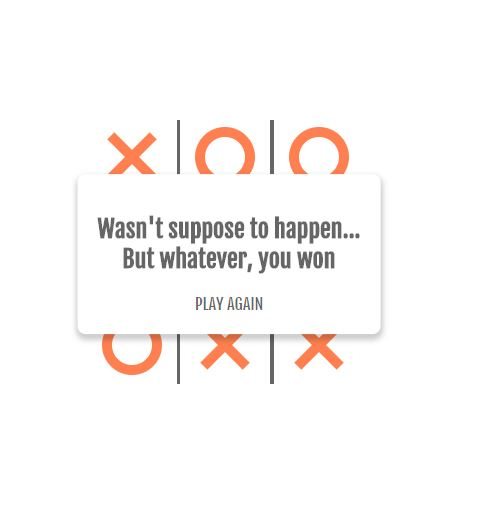
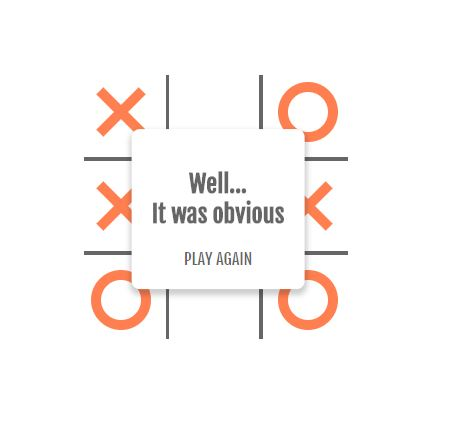

# TicTacToe game

Live on - https://shomikg.github.io/TicTacToe-Shom/
A short interactive game developed using Vanilla JS to play the game of TIC-TAC-TOE with a aimple AI robot.

## Technologies Used in this repo

* JavaScript ES6: plain JS (as opposed to jQuery, etc.) is used to dynamically query, create, modify, and remove HTML elements/nodes

## Features

1. A message appears if the wins or loses or draws the match with the AI.

2. The app keeps a count of all the marks done by the AI as well as user to decide the clear winner at the end of the game.

   

## Thoughts

Making games using just Vanilla JS is so much fun.